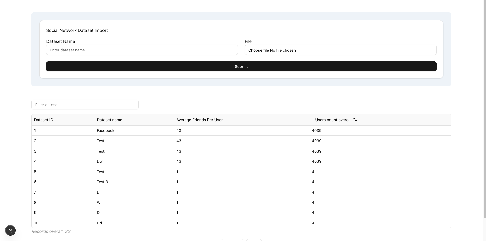
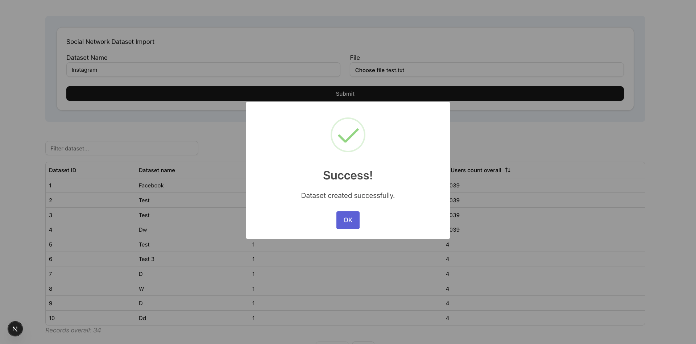

include images





# LinkSoft Social Network

This project consists of a frontend built with **Next.js** and a backend API using **ASP.NET**.

## Frontend (Next.js)

To run the frontend, navigate to the frontend directory and execute:

```sh
npm run dev
```

## Backend API (ASP.NET)

To run the backend API with hot reload and Swagger support, use:

```sh
dotnet watch run
```


## Notes
- Ensure you have `Entity Framework Core` installed and configured before running migration commands.
- Replace placeholders in `appsettings.json` with your actual database connection details
